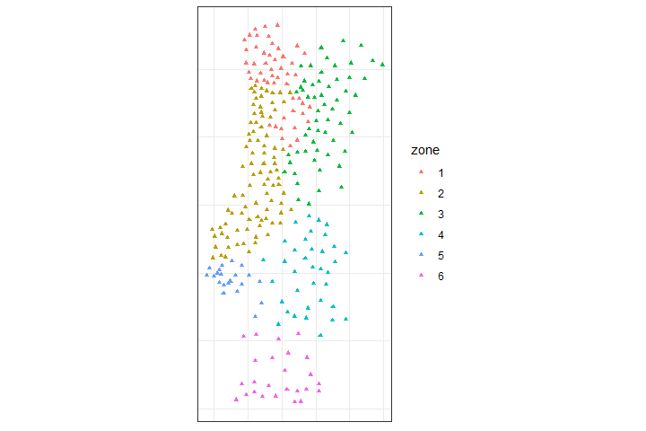

<!-- README.md is generated from README.Rmd. Please edit that file -->
<!-- badges: start -->


<!-- badges: end -->

The goal of **geosom** is to achieve
`Spatially-Aware Self-Organizing Maps(GeoSOM) Model` in R.

## Installation

You can install the development version of `geosom` from `github`:

``` r
# install.packages("devtools")
devtools::install_github("SpatLyu/geosom",build_vignettes = T,dep = T)
```

## Example

``` r
library(geosom)
data(pmc)

set.seed(20220724)
tictoc::tic()
geosom_bestparam(data = pmc, 
                 coords = c("centroidx","centroidy"),
                 wt = c(seq(0.1,1,by = 0.1),2:5),
                 xdim = 4:10, ydim = 4:10,cores = 6) -> g_bestparam
tictoc::toc()
## 53.59 sec elapsed
```

``` r
g = geosom(data = pmc, coords = c("centroidx","centroidy"), wt = .9,
           grid = geosomgrid(4,4,topo = "rectangular",
                             neighbourhood.fct = "gaussian"))
```

``` r
g_superclass = geosom_superclass(g,6,method = 'pam')
g_superclass
##  [1] 1 2 2 2 3 1 2 2 3 3 4 5 3 4 4 6
```

``` r
g_label = geosom_clusterlabel(g,g_superclass)
g_label
##   [1] 2 2 3 4 2 6 5 2 2 5 6 2 3 3 6 6 5 3 2 6 2 4 2 4 5 1 1 2 2 1 3 3 2 4 4 2 2
##  [38] 4 2 2 1 4 5 2 6 3 5 2 4 1 1 3 1 2 2 1 4 2 3 1 2 5 2 3 2 4 1 6 6 3 1 2 3 2
##  [75] 2 2 2 4 3 4 4 4 2 2 1 2 4 4 1 6 1 4 2 2 3 2 3 3 4 3 4 3 2 2 3 5 3 1 3 2 6
## [112] 6 1 2 5 6 5 2 2 1 2 3 2 2 3 3 2 2 4 2 2 3 1 6 3 2 2 3 3 3 1 5 1 6 1 4 1 4
## [149] 2 5 4 2 4 4 3 2 2 1 4 2 6 5 5 3 6 2 1 2 3 2 6 2 1 5 3 2 1 2 2 2 3 3 3 2 2
## [186] 3 3 2 1 1 4 4 4 6 2 2 1 1 3 4 4 1 3 2 3 3 2 2 2 3 2 6 1 6 2 3 1 2 1 3 5 3
## [223] 4 2 5 5 1 6 6 5 2 2 4 3 3 1 6 1 2 1 3 2 2 3 1 2 2 1 2 3 5 4 1 4 1 2 6 1 3
## [260] 5 2 1 1 3 2 1 2 3 3 6 3 1 4 3 3 1 1 1
```

``` r
library(sf)
library(dplyr)
library(ggplot2)

pmc %>% 
  mutate(zone = as.factor(g_label)) %>% 
  st_as_sf(coords = c("centroidx","centroidy")) %>% 
  ggplot() +
  geom_sf(aes(col = zone),size = 1.25,shape = 17) +
  scale_color_discrete(type = 'viridis') +
  theme_bw() +
  theme(axis.text = element_blank(),
        axis.ticks = element_blank())
```


